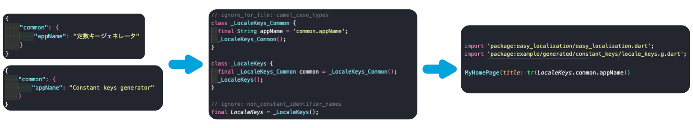

<!-- 
This README describes the package. If you publish this package to pub.dev,
this README's contents appear on the landing page for your package.

For information about how to write a good package README, see the guide for
[writing package pages](https://dart.dev/guides/libraries/writing-package-pages). 

For general information about developing packages, see the Dart guide for
[creating packages](https://dart.dev/guides/libraries/create-library-packages)
and the Flutter guide for
[developing packages and plugins](https://flutter.dev/developing-packages). 
-->


---

# Constant keys generator




A Flutter Dart library to generate a Dart file containing String constants representing the JSON path of a given JSON or YAML file. This tool helps developers manage JSON paths as constants in their Flutter projects.

## Features

- Input File: Accepts JSON or YAML file as input.
- Output File: Generates a Dart file containing String constants for all paths in the input file.
- Ease of Use: Running with `build_runner` build command
- Flutter-Compatible: Perfect for Flutter projects needing structured JSON path management.

## Install

Add the package to your pubspec.yaml:

```bash
flutter pub add --dev constant_keys_generator
```

## Guide to generate files

### 1. Setup the configuration file

Create your own yaml setting file named `constant_keys_generator.yaml` in the root folder of your project

```yaml
constant_keys_generator:
  # output_dir: The directory for output all generated files (inside lib directory)
  output_dir: "generated"

  # file_configs: List of files to generate
  #     Properties of each item:
  #         - input_file: file path, support glob path pattern (https://pub.dev/packages/glob)
  #         - output_file: name of output file without .g.dart extension
  file_configs:
    - input_file: "assets/translations/*.json"
      output_file: "locale_keys"
```

*OR*

Add your configuration into `pubspec.yaml`

### 2. Prepare the input files

Example: prepare 2 translation files inside `assets/translations` directory

**en.json**

```json
{
    "common": {
        "appName": "Constant keys generator"
    }
}
```

**vi.json**

```json
{
    "common": {
        "appName": "Trình tạo khóa cố định"
    }
}
```

### 3. Run the generator

To run the code generator, execute the following command:

```bash
dart run build_runner build
```

### 4. Verify the generated files

**example/lib/generated/constant_keys/locale_keys.g.dart**

```dart
// ignore_for_file: camel_case_types
class _LocaleKeys_Common {
  final String appName = 'common.appName';
  _LocaleKeys_Common();
}

class _LocaleKeys {
  final _LocaleKeys_Common common = _LocaleKeys_Common();
  _LocaleKeys();
}

// ignore: non_constant_identifier_names
final LocaleKeys = _LocaleKeys();
```

## Generated files' usecase

When we developed an application using the [easy_localization](https://pub.dev/packages/easy_localization) library, although this library provides a code generation mechanism, the results, whether in keys or json format, were not easy to use.

In `keys` format

```dart
// DO NOT EDIT. This is code generated via package:easy_localization/generate.dart

abstract class  LocaleKeys {
  static const common_appName = 'common.appName';
  static const common = 'common';

}
```

In `json` format

```dart
// DO NOT EDIT. This is code generated via package:easy_localization/generate.dart

// ignore_for_file: prefer_single_quotes, avoid_renaming_method_parameters

import 'dart:ui';

import 'package:easy_localization/easy_localization.dart' show AssetLoader;

class CodegenLoader extends AssetLoader{
  const CodegenLoader();

  @override
  Future<Map<String, dynamic>?> load(String path, Locale locale) {
    return Future.value(mapLocales[locale.toString()]);
  }

  static const Map<String,dynamic> ja = {
  "common": {
    "appName": "定数キージェネレータ"
  }
};
static const Map<String,dynamic> en = {
  "common": {
    "appName": "Constant keys generator"
  }
};
static const Map<String,dynamic> vi = {
  "common": {
    "appName": "Trình tạo khóa cố định"
  }
};
static const Map<String, Map<String,dynamic>> mapLocales = {"ja": ja, "en": en, "vi": vi};
}
```

Therefore, we developed this library as an alternative solution for generating type-safe keys for libraries like `easy_localization`.

*Generated file* from generator
```dart
// coverage:ignore-file
// GENERATED CODE - DO NOT MODIFY BY HAND

// *****************************************************
//  TKS Vietnam - constant_keys_generator
// *****************************************************

class _LocaleKeys_Common {
  final String appName = 'common.appName';
  _LocaleKeys_Common();
}

class _LocaleKeys {
  final _LocaleKeys_Common common = _LocaleKeys_Common();
  _LocaleKeys();
}

// ignore: non_constant_identifier_names
final LocaleKeys = _LocaleKeys();
```

And using with `easy_localization`

```dart
import 'package:easy_localization/easy_localization.dart';
import 'package:example/generated/constant_keys/locale_keys.dart';

Text(tr(LocaleKeys.common.appName))
```

or

```dart
import 'package:easy_localization/easy_localization.dart';
import 'package:example/generated/constant_keys/locale_keys.dart';

String appName = tr(LocaleKeys.common.appName))
```
